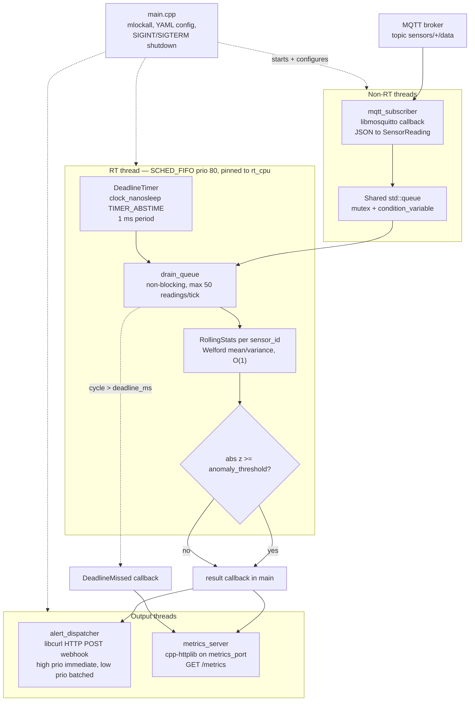
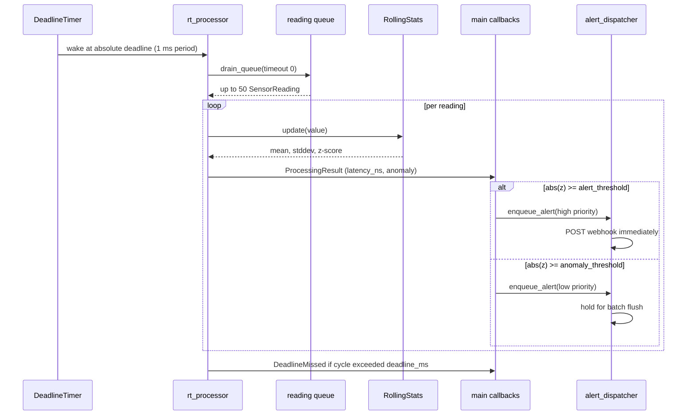

# SensorExpress

A C++17 real-time sensor data pipeline with 5 ms hard deadline guarantees, SCHED_FIFO scheduling, and online anomaly detection via Welford z-score statistics.

---

## Architecture



A tick of the RT loop looks like this:



---

## Real-Time Design

### SCHED_FIFO Scheduling

The processing thread runs under Linux's `SCHED_FIFO` policy at priority 80:

```cpp
struct sched_param param{ .sched_priority = 80 };
sched_setscheduler(0, SCHED_FIFO, &param);
```

`SCHED_FIFO` threads are never preempted by lower-priority tasks and don't get time-sliced. This guarantees the processor gets CPU time within microseconds of its wakeup.

### CPU Affinity

The RT thread is pinned to CPU 1 via `pthread_setaffinity_np`, isolating it from OS housekeeping tasks (typically on CPU 0) and avoiding cache-line contention.

### Memory Locking

`mlockall(MCL_CURRENT | MCL_FUTURE)` is called at startup before any RT threads are created. This pre-faults all pages into RAM, preventing page-fault latency spikes inside the 5 ms deadline window.

### 5 ms Deadline Guarantee

The `DeadlineTimer` uses `clock_nanosleep(CLOCK_MONOTONIC, TIMER_ABSTIME, ...)` with absolute wakeup times. Unlike relative sleeps, absolute deadlines don't accumulate drift across cycles. If a cycle overruns, the timer skips forward rather than cascading latency.

---

## Anomaly Detection

Online Welford statistics maintain per-sensor rolling mean and variance in O(1) time and O(1) space — no buffer required.

```
z = (value - mean) / stddev
```

| Threshold | Action |
|-----------|--------|
| `\|z\| ≥ 3.0` | Flag `ProcessingResult.anomaly = true` |
| `\|z\| ≥ 4.0` | Immediate HTTP POST to webhook |
| `\|z\| ≥ 3.0` (low) | Batched every 10 s |

A 30-sample warm-up prevents spurious anomalies while the estimator converges.

---

## Prometheus Metrics

Scraped at `http://localhost:9090/metrics`:

| Metric | Type | Description |
|--------|------|-------------|
| `sensor_express_readings_processed_total` | Counter | Total readings through RT pipeline |
| `sensor_express_deadline_misses_total` | Counter | Cycles exceeding 5 ms deadline |
| `sensor_express_anomalies_detected_total` | Counter | Flagged anomalous readings |
| `sensor_express_processing_latency_ns` | Histogram | Per-reading processing time (ns) |

---

## Build

### Prerequisites

- Linux kernel ≥ 4.14 (SCHED_FIFO + `clock_nanosleep`)
- CMake ≥ 3.16, GCC/Clang with C++17
- `libmosquitto-dev`, `libyaml-cpp-dev`, `libspdlog-dev`, `libcurl4-openssl-dev`
- `nlohmann-json3-dev`, `libgtest-dev`
- `httplib.h` at `/usr/local/include/httplib.h`

```bash
sudo apt install libmosquitto-dev libyaml-cpp-dev libspdlog-dev \
                 libcurl4-openssl-dev libnlohmann-json3-dev libgtest-dev

# httplib single-header
sudo curl -o /usr/local/include/httplib.h \
    https://raw.githubusercontent.com/yhirose/cpp-httplib/master/httplib.h

cmake -B build -DCMAKE_BUILD_TYPE=Release
cmake --build build -j$(nproc)
```

### Run tests

```bash
cd build && ctest --output-on-failure
```

---

## Run with Docker Compose

```bash
cd docker
docker compose up --build
```

Services:

| Service | Port | Description |
|---------|------|-------------|
| `mosquitto` | 1883 | MQTT broker |
| `sensor_express` | 9090 | RT pipeline + metrics |
| `simulator` | — | 20 sensors at 100 Hz |
| `prometheus` | 9091 | Metrics scraper |
| `grafana` | 3000 | Dashboard (admin/admin) |

> **Note:** The `sensor_express` service uses `network_mode: host` and `cap_add: [SYS_NICE, IPC_LOCK]` for RT scheduling. Docker Desktop on macOS/Windows does not support `SCHED_FIFO` — use a Linux host or VM.

---

## Run manually

```bash
# Start Mosquitto
mosquitto -c /etc/mosquitto/mosquitto.conf &

# Start pipeline (needs CAP_SYS_NICE for SCHED_FIFO)
sudo ./build/sensor_express config/pipeline.yaml

# Start simulator
python3 sim/sensor_simulator.py --host localhost --hz 100

# Check metrics
curl http://localhost:9090/metrics
```

---

## Configuration

See `config/pipeline.yaml` for all tuneable parameters including MQTT broker address, RT priority/CPU, deadline threshold, anomaly z-score thresholds, webhook URL, and log rotation settings.
